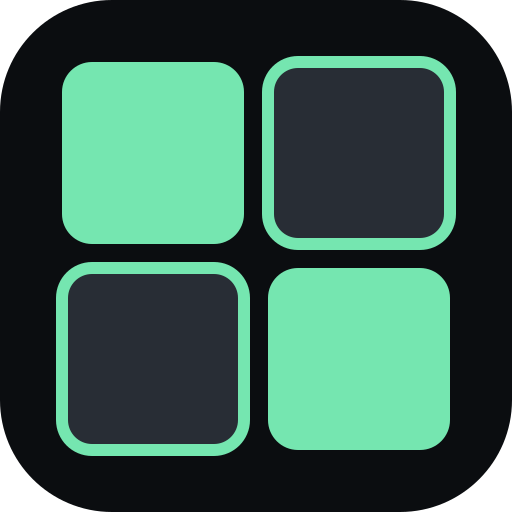

<p align="center">
  
</p>

# Agentic Tiles

**Run several coding-agent conversations at once without losing the thread.**

Agentic Tiles is a free and open-source tiled workspace for coding-agent CLIs. The VS Code
extension supports both Codex and Claude, while the desktop package currently supports Codex.
Keep four tasks visible, split the screen when another job appears, drag chats between panes, and
return later to the same layout.

It is available as a full-editor VS Code extension and as a native Ubuntu desktop app. It uses the
CLIs already installed on your machine, including their login, configuration, permissions, and
working directories. Agentic Tiles has no account, hosted backend, paid licence, or subscription
of its own.

> Agentic Tiles is an independent project. It is not affiliated with or endorsed by OpenAI or
> Anthropic. Provider services remain subject to their own terms and plan limits.

## Why Agentic Tiles?

One agent is a chat. Several agents are a workspace.

The standard single-panel experience makes parallel work hard to follow. Agentic Tiles keeps the
conversations that matter on screen together, while preserving the familiar chat workflow inside
every pane.

## Highlights

- **True tiled workspaces** — split any tile horizontally or vertically and resize it freely.
- **Tabs in every tile** — organize related conversations without sacrificing screen space.
- **Drag-and-drop layout** — drag a chat from the sidebar into an empty or occupied tile.
- **Live agent activity** — follow messages, reasoning summaries, commands, tools, approvals, and
  clarification requests as they happen.
- **Live provider usage** — see the remaining Codex and Claude allowance without reloading VS Code.
- **Queue and steer follow-ups** — line up multiple prompts while an agent works, or send any
  queued message into the active turn immediately.
- **Built-in change review** — inspect affected files and unified diffs directly in the chat.
- **Useful file links** — open, reveal, or copy local file paths from agent responses.
- **Per-chat controls** — model, reasoning effort, collaboration mode, sandbox, approvals, and
  network access stay with the conversation they configure.
- **Completion sounds** — unmute individual chats and choose Chime, Bell, Pop, Double beep, or
  Rising when an agent finishes a response. Chats start muted; sound choices and mute settings
  survive restarts. Use **Sound off / Sound on** and **Preview** in the chat controls. After
  reopening the app, click or press a key to enable audio for previously unmuted chats.
- **Persistent setup** — tile splits, sizes, tabs, active chats, sidebar width, and settings survive
  restarts.
- **Native VS Code theming** — the extension follows the active editor color theme.
- **Chat slash commands** — use `/plan`, `/usage`, `/status`, `/model`, `/reasoning`, and `/help`.

## Editions

| Edition | Best for | Status |
| --- | --- | --- |
| VS Code extension | Codex and Claude beside your code | Ubuntu/Linux supported |
| Desktop app | A dedicated Codex workspace | Ubuntu `.deb` package |

## Requirements

- Ubuntu or another compatible Linux environment.
- VS Code 1.90 or newer for the extension.
- The `codex` CLI installed and authenticated.
- `codex` available on `PATH`, in a common NVM/npm location, or configured explicitly.
- For Claude chats in VS Code, an authenticated `claude` CLI or compatible remote launcher.

Agentic Tiles launches the installed CLIs and does not bundle or replace them.

## Install the VS Code extension locally

```bash
cd vscode-extension
npm ci
npm run package
code --install-extension dist/agentic-tiles-0.3.1.vsix
```

Then click the **Agentic Tiles** layout icon in the editor title bar, or run
**Agentic Tiles: Open Agentic Tiles** from the Command Palette.

## Build the Ubuntu desktop package

```bash
./scripts/build-deb.sh
sudo apt install ./release/agentic-tiles_0.4.2_amd64.deb
```

The containerized build targets Debian 12-compatible WebKitGTK libraries and keeps Rust/Tauri
build dependencies out of the host system.

## Security and privacy

Agentic Tiles does not add telemetry, create an Agentic Tiles account, or send conversations to an
Agentic Tiles server. Workspace layout is stored locally. Each CLI communicates according to the
user's existing provider configuration.

**New chats currently default to full filesystem access, network enabled, and “never ask” approval
mode.** These defaults are convenient for an autonomous local workflow but grant the agent broad
authority. Review the per-chat controls before using Agentic Tiles with untrusted repositories or
prompts.

## Development

```bash
npm ci
npm test
npm run build

cd vscode-extension
npm ci
npm test
npm run build
```

For the native app, install the standard Tauri 2 Linux prerequisites and Rust, then run:

```bash
npm run tauri dev
```

The React interface in `src/` is shared by the Tauri desktop host and the VS Code webview. Each
host provides a small bridge for agent requests, persistence, and native UI operations. Claude
support currently lives in the VS Code host; the Tauri desktop host continues to use Codex only.

## Contributing

Issues and pull requests are welcome. Please run the relevant tests and build before submitting a
change. See [CONTRIBUTING.md](CONTRIBUTING.md) for the short development guide.

## Licence

Agentic Tiles is free and open-source software released under the [MIT License](LICENSE).
